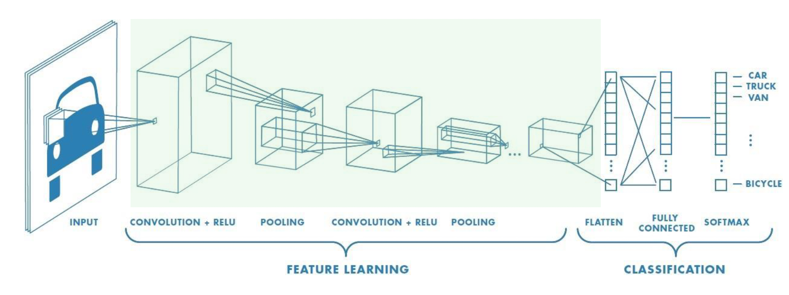

# Computer Vision with PyTorch

A collection of practical computer vision projects implemented using **PyTorch**. This repository covers the fundamentals of Convolutional Neural Networks (CNNs), transfer learning with pretrained models, and real-world image classification applications. Each notebook has been reorganized, documented, and expanded to serve as a technical portfolio demonstrating modern deep learning workflows for computer vision.



---

# 🚀 Repository Overview

This repository demonstrates end-to-end computer vision workflows using PyTorch, from building convolutional neural networks to leveraging pretrained models for transfer learning. It emphasizes both the theoretical foundations and practical implementation of deep learning techniques for image classification.

---

# 📚 Topics Covered

- Convolutional Neural Networks (CNNs)
- Convolution and feature extraction
- Pooling operations
- Image classification
- PyTorch deep learning workflows
- GPU acceleration with CUDA
- Transfer learning
- Feature extraction using pretrained models
- Fine-tuning pretrained CNNs
- Data augmentation
- Model evaluation
- Preventing overfitting
- Visualizing convolution kernels

---

# 🛠️ Technologies

- Python
- PyTorch
- Torchvision
- NumPy
- Matplotlib
- Scikit-learn
- PIL (Python Imaging Library)

---

# 📂 Repository Structure

```text
computer-vision-pytorch/
│
├── README.md
├── requirements.txt
├── .gitignore
│
├── 01_cnn_fundamentals.ipynb
├── 02_transfer_learning.ipynb
├── 03_hand_gesture_recognition.ipynb
│
├── datasets/
├── images/
└── models/
```

---

# 📖 Notebooks

| Notebook | Description | Status |
|----------|-------------|:------:|
| **01 – CNN Fundamentals** | Learn the fundamentals of convolutional neural networks, feature extraction, convolution kernels, pooling, GPU acceleration, and image classification using PyTorch. | ✅ |
| **02 – Transfer Learning** | Apply transfer learning using pretrained CNNs (AlexNet) for image classification, compare feature extraction and fine-tuning, and explore techniques for preventing overfitting. | ✅ |
| **03 – Hand Gesture Recognition** | Build an end-to-end hand gesture recognition system using convolutional neural networks, including dataset preprocessing, training, evaluation, and prediction. | ✅ |

---

# 🎯 Learning Objectives

Throughout this repository, I explore how to:

- Understand the architecture of convolutional neural networks.
- Extract visual features using convolutional filters.
- Build CNN models using PyTorch.
- Train and evaluate image classification models.
- Apply transfer learning using pretrained networks.
- Fine-tune pretrained models for new datasets.
- Prevent overfitting using practical deep learning techniques.
- Develop complete computer vision pipelines.

---

# 🚀 Getting Started

Clone the repository:

```bash
git clone https://github.com/Miladsaeedi70/computer-vision-pytorch.git
```

Install the required packages:

```bash
pip install -r requirements.txt
```

Launch Jupyter Notebook:

```bash
jupyter notebook
```

Begin with **Notebook 1** and continue through the notebooks in numerical order.

---

# ⭐ About This Repository

This repository is part of my continuous learning journey in **Computer Vision**, **Deep Learning**, and **PyTorch**. It is designed as a technical portfolio showcasing practical implementations of convolutional neural networks, transfer learning, and image classification through well-documented, hands-on projects.